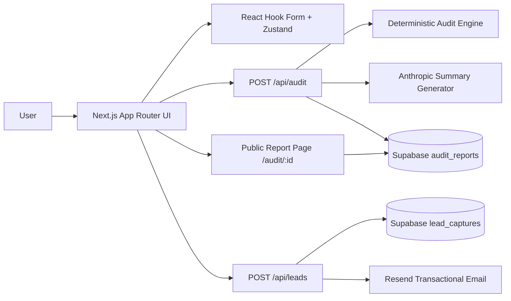

# Architecture

## System Overview



## Key Decisions

- The audit engine is rule-based and deterministic so the same inputs always produce the same recommendations.
- The AI summary is isolated behind a fallback path so the report still works if Anthropic is down or unconfigured.
- Public URLs use opaque IDs to avoid leaking any company or personal identifiers.
- LocalStorage persistence is handled client-side to reduce friction during form entry.
- Supabase writes happen server-side to keep credentials off the client.

## Folder Structure

```text
app/
  api/
    audit/
    health/
    leads/
  audit/[id]/
  globals.css
  layout.tsx
  page.tsx
components/
  audit/
  ui/
lib/
  audit-engine/
  abuse.ts
  env.ts
  store.ts
  summary.ts
  validation.ts
state/
  use-audit-store.ts
supabase/
  schema.sql
  seed.sql
tests/
```

